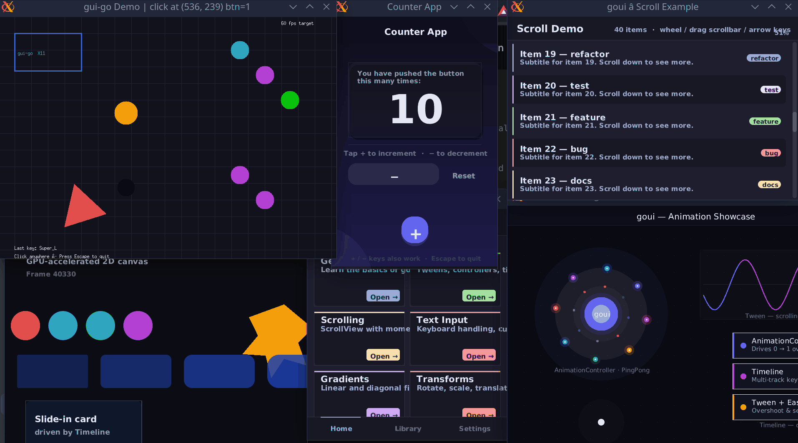

# goui (gui-go)

A lightweight, GPU-accelerated 2D GUI library for Go, specifically designed for Linux (X11).



## ✨ Features

* **Dual Rendering Backends**: 
    * **OpenGL 2.1**: Primary renderer using GLSL 1.20 for maximum hardware compatibility[cite: 333, 334].
    * **Software Fallback**: A CPU-side fallback using Go's `image` package when OpenGL is unavailable[cite: 438, 439].
* **Comprehensive Animation Engine**: 
    * **Controllers & Timelines**: Drive complex, multi-track animations over time[cite: 528, 647].
    * **Tweens & Easing**: 15+ built-in easing functions including Bounce, Elastic, and Back[cite: 739, 750].
* **Retained UI Components**: 
    * **Navigation**: Screen-stack management with `Navigator`[cite: 481].
    * **Layout**: Easy `Row`, `Column`, and `Grid` distribution[cite: 846, 849, 851].
    * **Widgets**: Buttons, ScrollViews (with momentum), TabBars, and TextInputs[cite: 549, 593, 776, 782].
* **Advanced 2D Drawing**: 
    * SDF-based rounded rectangles[cite: 317].
    * Linear gradients and custom paths[cite: 314, 504].
    * GPU-resident Font Atlas for high-performance text rendering[cite: 50, 425].


## 🛠 Installation

`goui` uses CGo to interface with X11 directly. Ensure you have the X11 and OpenGL development headers installed on your system.

```bash
go get https://github.com/achiket/gui-go

```

## 🚀 Quick Start

```go
package main

import (
	goui "github.com/achiket/gui-go"
	"github.com/achiket/gui-go/canvas"
)

func main() {
	// Create a window
	w := goui.NewWindow("Hello goui", 800, 600)

	// Register a draw callback
	w.OnDrawGL(func(c *canvas.Canvas) {
		c.Clear(canvas.RGB8(18, 18, 28))

		// Draw a rounded rect with a blue fill
		paint := canvas.FillPaint(canvas.Blue)
		c.DrawRoundedRect(50, 50, 200, 100, 12, paint)

		c.DrawText(60, 95, "Hello GPU!", canvas.DefaultTextStyle())
	})

	w.Show() 
}


```

## 📂 Examples

This repository contains several examples showcasing the framework's capabilities:

* 
`animation`: Orbiting particles, pulse effects, and timelines.


* 
`counter`: A stylish app demonstrating scale tweens and button interaction.


* 
`routing`: Advanced navigation between screens, tab bars, and modals.


* 
`scrollables`: Smooth list scrolling with momentum and scrollbars.


* 
`shapes`: Gradients, polygons, and GPU-based transformations.


## 🏗 Architecture

The library is organized into three distinct layers:

1. 
**Platform Layer**: Raw CGo bindings for Xlib and GLX.


2. 
**Render Layer**: An abstraction (interface) between drawing logic and the hardware.


3. 
**UI/Canvas Layer**: High-level API for developers to build stateful components and perform drawing.


## 📄 License

This project is licensed under the MIT License.

```

Would you like me to help you set up a **GitHub Pages** configuration or a **Docusaurus** site to host this content as a full website?

```